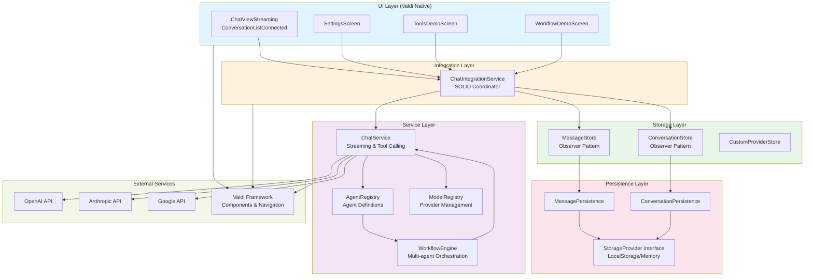
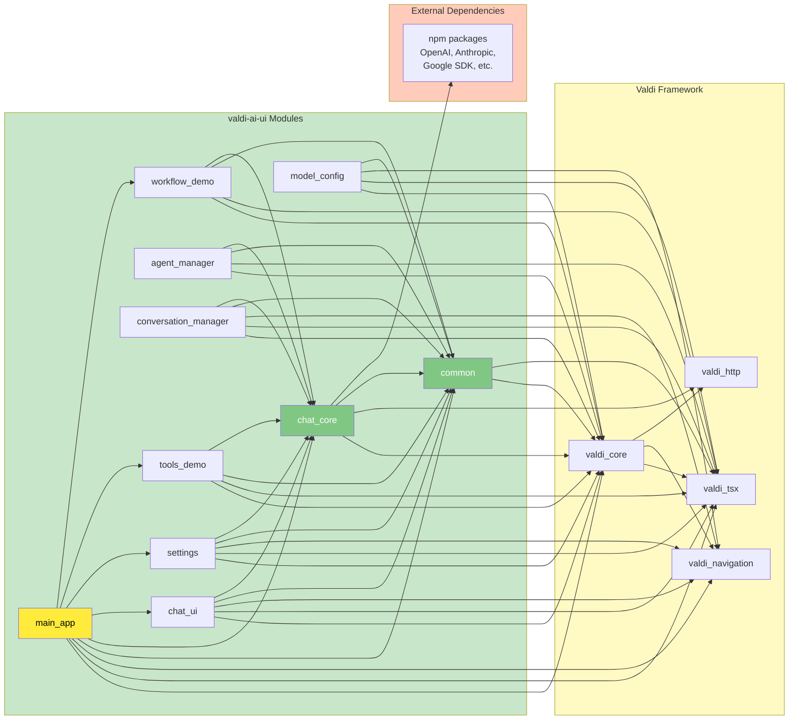
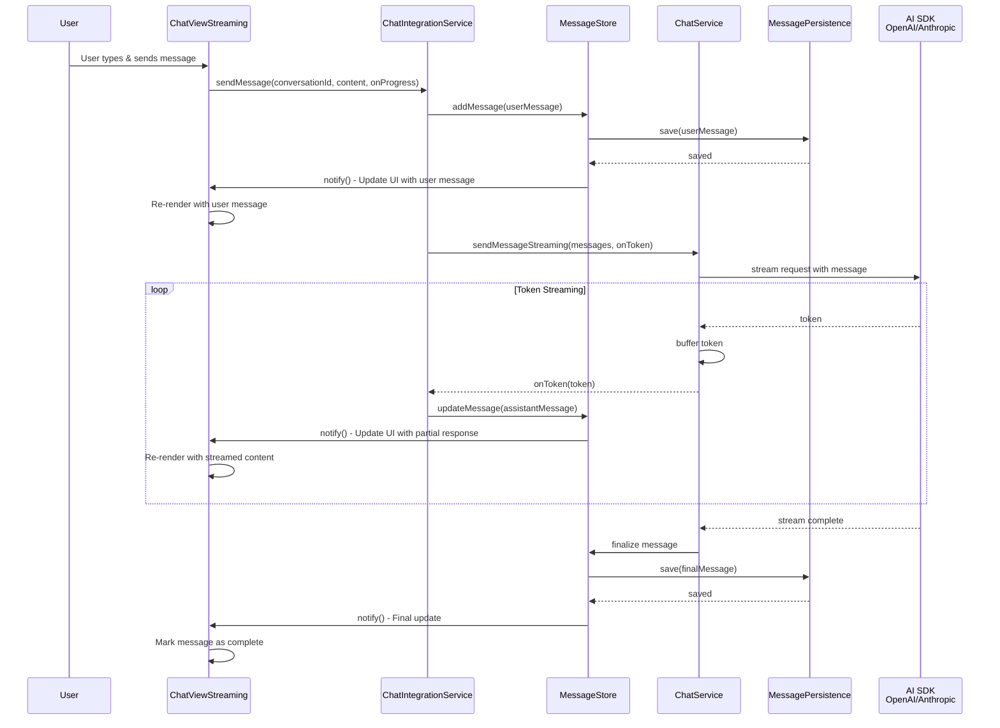
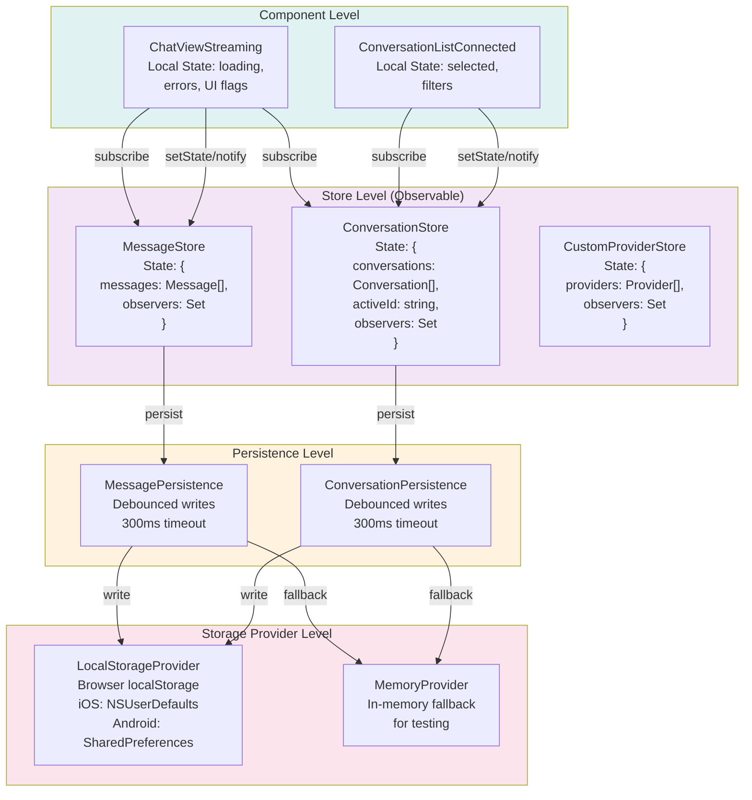

# Architecture Documentation

Valdi AI UI follows a modular, layered architecture with strict separation of concerns and SOLID principles.

## Table of Contents

- [System Overview](#system-overview)
- [Architecture Principles](#architecture-principles)
- [Layer Breakdown](#layer-breakdown)
- [Module Structure](#module-structure)
- [Data Flow](#data-flow)
- [Integration Patterns](#integration-patterns)
- [State Management](#state-management)
- [Design Patterns](#design-patterns)

---

## System Overview

### Layered Architecture
```
┌─────────────────────────────────────────────────────────────┐
│                     Presentation Layer                       │
│  (Chat UI, Settings, Demos, Conversation Manager UI)        │
└────────────────────┬────────────────────────────────────────┘
                     │
┌────────────────────▼────────────────────────────────────────┐
│                  Integration Layer                           │
│         (ChatIntegrationService - SOLID Coordinator)         │
└────────────────────┬────────────────────────────────────────┘
                     │
┌────────────────────▼────────────────────────────────────────┐
│                    Service Layer                             │
│  (ChatService, AgentRegistry, WorkflowEngine, ModelRegistry) │
└────────────────────┬────────────────────────────────────────┘
                     │
┌────────────────────▼────────────────────────────────────────┐
│                    Storage Layer                             │
│    (MessageStore, ConversationStore, CustomProviderStore)    │
└────────────────────┬────────────────────────────────────────┘
                     │
┌────────────────────▼────────────────────────────────────────┐
│                 Persistence Layer                            │
│      (StorageProvider, MessagePersistence, etc.)             │
└─────────────────────────────────────────────────────────────┘
```

### System Architecture Diagram



---

## Architecture Principles

### SOLID Principles

**Single Responsibility Principle (SRP)**
- Each class has one reason to change
- Example: `ChatIntegrationService` only coordinates, doesn't implement business logic

**Open/Closed Principle (OCP)**
- Open for extension, closed for modification
- Example: Add new providers without modifying `ModelRegistry`

**Liskov Substitution Principle (LSP)**
- Subtypes must be substitutable for their base types
- Example: Any `StorageProvider` implementation works

**Interface Segregation Principle (ISP)**
- Clients shouldn't depend on interfaces they don't use
- Example: Small, focused interfaces like `StreamProgressCallback`

**Dependency Inversion Principle (DIP)**
- Depend on abstractions, not concretions
- Example: `ChatIntegrationService` accepts interfaces via constructor

### DRY (Don't Repeat Yourself)
- Single source of truth for all logic
- Reusable utilities and helpers
- Shared type definitions

### KISS (Keep It Simple, Stupid)
- Simple, clear method names
- Minimal abstraction
- Easy-to-understand flow
- No over-engineering

---

## Layer Breakdown

### 1. Presentation Layer

**Responsibility:** User interface components

**Technologies:**
- Valdi Components (StatefulComponent, NavigationPageComponent)
- Valdi TSX (View, Label, ScrollView)
- Style system

**Key Components:**
- `ChatViewStreaming` - Streaming chat interface
- `ConversationListConnected` - Reactive conversation list
- `SettingsScreen` - Application settings
- `ToolsDemoScreen` - Tool demonstrations
- `WorkflowDemoScreen` - Workflow demonstrations

**Patterns:**
- Component composition
- Props/State management
- Event delegation

### 2. Integration Layer

**Responsibility:** Coordinate between UI and services

**Key Class:** `ChatIntegrationService`

**Methods:**
```typescript
sendMessage(conversationId, content, onProgress)
navigateToConversation(conversationId, ChatViewComponent)
createAndNavigateToConversation(title, ChatViewComponent)
loadConversationMessages(conversationId)
loadAllConversations()
loadConversationsFiltered(filter)
subscribeToConversations(callback)
subscribeToMessages(conversationId, callback)
```

**Design:**
- Single point of coordination
- Dependency injection
- Observer pattern for subscriptions
- Clean separation from UI and services

### 3. Service Layer

**Responsibility:** Business logic and AI operations

**Services:**

**ChatService**
- AI model integration (OpenAI, Anthropic, Google)
- Streaming responses
- Tool calling
- Message formatting

**AgentRegistry**
- Agent definition management
- Capability-based lookup
- Pre-configured agents (Research, Code, Creative, Analyst)

**WorkflowEngine**
- Multi-agent orchestration
- 4 execution patterns (Sequential, Parallel, Routing, Evaluator-Optimizer)
- Workflow lifecycle management

**ModelRegistry**
- Built-in provider management
- Custom provider integration
- Model capability tracking

**LoopController**
- Iterative agent execution
- Stop conditions
- Timeout management

### 4. Storage Layer

**Responsibility:** In-memory state management

**Stores:**

**MessageStore**
- Message CRUD operations
- Conversation-based filtering
- Reactive updates via Observer pattern

**ConversationStore**
- Conversation CRUD operations
- Status management (active/archived)
- Metadata tracking

**CustomProviderStore**
- Custom provider configurations
- Validation
- Import/export

**Pattern:**
```typescript
class Store {
  private state: State
  private observers: Set<(state: State) => void>

  subscribe(observer): UnsubscribeFn
  notify(): void
  setState(partial: Partial<State>): void
}
```

### 5. Persistence Layer

**Responsibility:** Data persistence

**Providers:**

**StorageProvider** (Interface)
- `LocalStorageProvider` - Browser localStorage
- `MemoryProvider` - In-memory fallback

**Implementations:**
- `MessagePersistence` - Persists messages
- `ConversationPersistence` - Persists conversations
- Auto-save with debouncing

---

## Module Structure

```
modules/
├── common/                 # Shared utilities and components
│   ├── src/
│   │   ├── components/    # UI components (Button, Card, etc.)
│   │   ├── theme/         # Colors, Fonts, Spacing
│   │   ├── types/         # Shared types (Message, Conversation)
│   │   ├── services/      # StorageProvider
│   │   └── utils/         # Utility functions
│   └── BUILD.bazel
│
├── chat_core/             # AI chat services
│   ├── src/
│   │   ├── ChatService.ts
│   │   ├── MessageStore.ts
│   │   ├── ConversationStore.ts
│   │   ├── ToolDefinitions.ts
│   │   └── persistence/
│   └── BUILD.bazel
│
├── chat_ui/               # Chat UI components
│   ├── src/
│   │   ├── ChatViewStreaming.tsx
│   │   ├── ConversationListConnected.tsx
│   │   ├── ChatIntegrationService.ts
│   │   ├── MessageBubble.tsx
│   │   └── InputBar.tsx
│   └── BUILD.bazel
│
├── agent_manager/         # Multi-agent orchestration
│   ├── src/
│   │   ├── AgentRegistry.ts
│   │   ├── WorkflowEngine.ts
│   │   └── LoopController.ts
│   └── BUILD.bazel
│
├── conversation_manager/  # Conversation history management
│   ├── src/
│   │   ├── HistoryManager.ts
│   │   ├── ConversationListView.tsx
│   │   └── SearchBar.tsx
│   └── BUILD.bazel
│
├── model_config/          # Model configuration
│   ├── src/
│   │   ├── ModelRegistry.ts
│   │   ├── CustomProviderStore.ts
│   │   ├── ModelSelectorView.tsx
│   │   └── AddCustomProviderView.tsx
│   └── BUILD.bazel
│
├── settings/              # Application settings
│   ├── src/
│   │   ├── SettingsScreen.tsx
│   │   └── ApiKeyStore.ts
│   └── BUILD.bazel
│
├── tools_demo/            # Tool calling demonstrations
├── workflow_demo/         # Workflow demonstrations
└── main_app/              # Main application entry
```

### Module Dependencies Graph



---

## Data Flow

### Message Send Flow

```
User Input
    ↓
ChatViewStreaming.handleSend()
    ↓
ChatIntegrationService.sendMessage()
    ↓
├─→ MessageStore.addMessage(userMessage)
│       ↓
│   MessagePersistence.save()
│
└─→ ChatService.sendMessageStreaming()
        ↓
    AI SDK (OpenAI/Anthropic/Google)
        ↓
    Stream tokens back
        ↓
    MessageStore.updateMessage(assistantMessage)
        ↓
    Notify observers
        ↓
    ChatViewStreaming updates (reactive)
```

### Conversation Navigation Flow

```
User tap on conversation
    ↓
ConversationListConnected.handleConversationTap()
    ↓
ChatIntegrationService.navigateToConversation()
    ↓
├─→ ConversationStore.setActiveConversation()
│
└─→ NavigationController.push(ChatView, { conversationId })
        ↓
    ChatViewStreaming mounts
        ↓
    Load messages
        ↓
    Subscribe to updates
```

### Detailed Message Flow Sequence Diagram



---

## Integration Patterns

### Observer Pattern (Reactive State)

```typescript
// Store implementation
class MessageStore {
  private observers = new Set<(state: State) => void>()

  subscribe(observer: (state: State) => void): () => void {
    this.observers.add(observer)
    return () => this.observers.delete(observer)
  }

  notify(): void {
    this.observers.forEach(obs => obs(this.state))
  }
}

// Component usage
componentDidMount() {
  this.unsubscribe = messageStore.subscribe((state) => {
    this.setState({ messages: state.messages })
  })
}

componentWillUnmount() {
  this.unsubscribe?.()
}
```

### Dependency Injection

```typescript
// Service accepts dependencies
class ChatIntegrationService {
  constructor(config: ChatIntegrationConfig) {
    this.chatService = config.chatService
    this.messageStore = config.messageStore
    this.conversationStore = config.conversationStore
  }
}

// Component uses injected service
class ChatViewStreaming {
  constructor(props) {
    this.integrationService = props.integrationService
  }
}
```

### Factory Pattern

```typescript
// Create providers dynamically
class ModelRegistry {
  private providers = new Map<ProviderType, ProviderConfig>()

  getProvider(type: ProviderType): ProviderConfig {
    return this.providers.get(type)
  }
}
```

---

## State Management

### Local Component State
- UI-specific state (loading, errors)
- Managed via `this.state` and `setState()`

### Global Store State
- Shared data (messages, conversations)
- Observable pattern with subscriptions
- Immutable updates

### Persistence State
- Automatic save on changes
- Debounced writes
- Storage provider abstraction

**State Update Flow:**
```
User Action
    ↓
Component Method
    ↓
Integration Service
    ↓
Store Method (setState)
    ↓
Notify Observers
    ↓
Component Re-render
    ↓
Persist to Storage (debounced)
```

### State Management Architecture



### Observer Pattern Implementation

```mermaid
classDiagram
    class Observer {
        <<interface>>
        update(state: State)*
    }

    class Store {
        -state: State
        -observers: Set~Observer~
        +subscribe(observer: Observer): UnsubscribeFn
        +setState(partial: Partial~State~): void
        -notify(): void
    }

    class MessageStore {
        -state: MessageStoreState
        -observers: Set~Observer~
        +addMessage(message: Message): void
        +updateMessage(id: string, content: string): void
        +deleteMessage(id: string): void
        +getMessages(conversationId: string): Message[]
    }

    class ConversationStore {
        -state: ConversationStoreState
        -observers: Set~Observer~
        +addConversation(title: string): Conversation
        +updateConversation(id: string, data: Partial~Conversation~): void
        +setActiveConversation(id: string): void
        +getActiveConversation(): Conversation
    }

    class Component {
        -unsubscribe: UnsubscribeFn
        +componentDidMount(): void
        +componentWillUnmount(): void
        -onStoreUpdate(state: State): void
    }

    Store <|-- MessageStore
    Store <|-- ConversationStore
    Observer <|-- Component
    Store -->|notify| Observer
    Component -->|subscribe| Store

    style Store fill:#b2dfdb
    style MessageStore fill:#81c784
    style ConversationStore fill:#81c784
    style Observer fill:#ffb74d
    style Component fill:#64b5f6
```

---

## Design Patterns

### 1. Observer Pattern
**Where:** All stores (MessageStore, ConversationStore)
**Why:** Reactive UI updates without tight coupling

### 2. Dependency Injection
**Where:** ChatIntegrationService, Services
**Why:** Testability, flexibility, SOLID compliance

### 3. Factory Pattern
**Where:** ModelRegistry, AgentRegistry
**Why:** Dynamic creation of providers/agents

### 4. Strategy Pattern
**Where:** WorkflowEngine (4 execution strategies)
**Why:** Interchangeable workflow execution logic

### 5. Repository Pattern
**Where:** MessagePersistence, ConversationPersistence
**Why:** Abstract storage details from business logic

### 6. Facade Pattern
**Where:** ChatIntegrationService
**Why:** Simplified interface to complex subsystems

### 7. Singleton Pattern
**Where:** Global store instances (messageStore, conversationStore)
**Why:** Single source of truth

### Design Patterns Visualization

```mermaid
graph TB
    subgraph ObserverPat["Observer Pattern"]
        O1["Store"]
        O2["Component 1"]
        O3["Component 2"]
        O1 -->|notify| O2
        O1 -->|notify| O3
        O2 -->|subscribe| O1
        O3 -->|subscribe| O1
    end

    subgraph DIPattern["Dependency Injection"]
        DI1["ChatIntegrationService"]
        DI2["ChatService"]
        DI3["MessageStore"]
        DI1 -->|depends on| DI2
        DI1 -->|depends on| DI3
    end

    subgraph FactoryPat["Factory Pattern"]
        F1["ModelRegistry"]
        F2["Provider 1"]
        F3["Provider 2"]
        F1 -->|creates| F2
        F1 -->|creates| F3
    end

    subgraph StrategyPat["Strategy Pattern"]
        S1["WorkflowEngine"]
        S2["Sequential Strategy"]
        S3["Parallel Strategy"]
        S4["Routing Strategy"]
        S1 -->|executes with| S2
        S1 -->|executes with| S3
        S1 -->|executes with| S4
    end

    subgraph RepositoryPat["Repository Pattern"]
        R1["MessageStore"]
        R2["MessagePersistence"]
        R3["StorageProvider"]
        R1 -->|persists via| R2
        R2 -->|writes to| R3
    end

    subgraph FacadePat["Facade Pattern"]
        FA1["ChatIntegrationService<br/>Simplified Interface"]
        FA2["ChatService<br/>Complex Logic"]
        FA3["MessageStore"]
        FA4["ConversationStore"]
        FA1 -->|coordinates| FA2
        FA1 -->|coordinates| FA3
        FA1 -->|coordinates| FA4
    end

    subgraph SingletonPat["Singleton Pattern"]
        SI1["Global messageStore<br/>Instance"]
        SI2["Global conversationStore<br/>Instance"]
        SI3["Various Components"]
        SI3 -->|uses| SI1
        SI3 -->|uses| SI2
    end

    style ObserverPat fill:#e1f5fe
    style DIPattern fill:#f3e5f5
    style FactoryPat fill:#e8f5e9
    style StrategyPat fill:#fff3e0
    style RepositoryPat fill:#fce4ec
    style FacadePat fill:#f1f8e9
    style SingletonPat fill:#ede7f6
```



---

## Testing Strategy

### Unit Tests
- Test individual functions and classes
- Mock dependencies
- Focus on business logic

### Component Tests
- Test UI components in isolation
- Mock services and stores
- Verify rendering and interactions

### Integration Tests
- Test complete flows (send message, navigate)
- Use real stores (or test doubles)
- Verify end-to-end behavior

**Test Structure:**
```typescript
describe('ChatIntegrationService', () => {
  let service: ChatIntegrationService
  let mockChatService: ChatService
  let mockMessageStore: MessageStore

  beforeEach(() => {
    mockChatService = createMockChatService()
    mockMessageStore = createMockMessageStore()
    service = new ChatIntegrationService({
      chatService: mockChatService,
      messageStore: mockMessageStore,
      // ...
    })
  })

  it('should send message and stream response', async () => {
    // Test implementation
  })
})
```

---

## Build System

### Bazel
- Module-level BUILD.bazel files
- Dependency declarations
- Visibility control

**Example:**
```python
valdi_module(
    name = "chat_ui",
    srcs = glob(["src/**/*.ts", "src/**/*.tsx"]),
    visibility = ["//visibility:public"],
    deps = [
        "@valdi//src/valdi_modules/src/valdi/valdi_core",
        "@valdi//src/valdi_modules/src/valdi/valdi_tsx",
        "@valdi//src/valdi_modules/src/valdi/valdi_navigation",
        "//apps/valdi_ai_ui/modules/common",
        "//apps/valdi_ai_ui/modules/chat_core",
    ],
)
```

---

## Performance Considerations

### 1. Message Pagination
- Load messages in batches
- Virtual scrolling for long conversations

### 2. Debounced Updates
- Debounce persistence writes (300ms)
- Debounce search input (300ms)

### 3. Lazy Loading
- Load conversations on demand
- Code splitting for large modules

### 4. Memoization
- Cache expensive computations
- Avoid unnecessary re-renders

---

## Security Considerations

### 1. API Key Storage
- iOS: Keychain
- Android: EncryptedSharedPreferences
- Never log or expose keys

### 2. Input Validation
- Validate all user inputs
- Sanitize before persistence
- Type checking with TypeScript

### 3. Error Handling
- Don't expose internal errors to users
- Log errors securely
- Graceful degradation

---

## Extension Points

### Adding a New AI Provider

1. Update `ModelRegistry` with provider details
2. Add provider to `ChatService` switch
3. Update `SettingsScreen` UI
4. Add provider to types

### Adding a New Workflow Pattern

1. Implement in `WorkflowEngine`
2. Add type to `WorkflowConfig`
3. Create demo in `workflow_demo`

### Adding a New Tool

1. Define in `ToolDefinitions.ts`
2. Add to `getAllTools()`
3. Update tool executor
4. Add demo in `tools_demo`

---

## Future Enhancements

1. **Offline Support** - Service workers, local-first architecture
2. **Real-time Collaboration** - WebSocket integration
3. **Voice Input** - Speech-to-text integration
4. **File Attachments** - Image/document support
5. **Advanced Search** - Full-text search, filters
6. **Analytics** - Usage tracking, performance monitoring
7. **Plugin System** - Third-party extensions

---

Last Updated: November 2024
Version: 0.2.0
